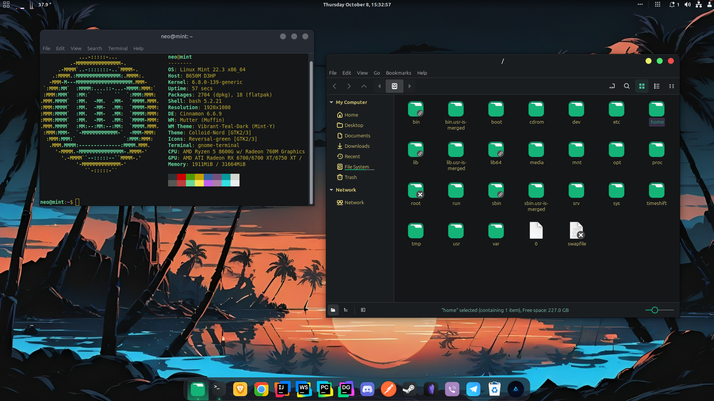

# Neo Mint Theme

A desktop customization app for **Linux Mint 22.3 Cinnamon on X11**. Give your desktop a dark teal appearance with green icons, a top panel, a Plank dock and matching terminal colors — then adjust it for your screen.

**Beta:** tested in a Mint 22.3 Cinnamon VM. Feedback is welcome; more customization options are planned.



The wallpaper and additional apps shown above are not included. Keep your current wallpaper or choose your own image.

## Install

[Download the 1.0.3 beta](https://github.com/nikolaPantelic98/neo-mint-theme/releases/tag/v1.0.3) and open the `.deb` with Linux Mint's package installer. It installs the app and required dependencies; your appearance changes only when you click Apply.

You can also install it from a terminal in the download folder:

```bash
sudo apt install ./neo-mint-theme_1.0.3_all.deb
```

Open **Neo Mint Theme** from the menu as your normal user. Choose your settings, click **Review Changes**, then **Apply Customization**.

## Make it yours

- Apply the application theme, desktop theme, icons, panel, dock, terminal and effects individually.
- Keep your wallpaper or select a local image, with Zoom, Fit, Stretch or Center.
- Adjust font sizes, text scaling, cursor size, panel height and icon sizes. Font families are fixed.
- Set clock format, date and seconds; enable the system monitor and temperature indicator where supported.
- Adjust dock size, zoom, auto-hide, monitor and startup; enable transparent panels and window effects.

Defaults are intended for a **24-inch display**. Resolution and scaling may require adjustments. Settings can be changed and applied again later.

**Undo Last Apply** reverses the most recent change. **Restore Original Appearance** returns to the appearance saved before your first customization. Restore before uninstalling if you want to remove the customization too.

If the auto-hidden dock is difficult to reveal, move the pointer to the bottom edge beneath its icons, or turn off **Dock → Auto-hide**.

## Updates

Download the new `.deb` from [Releases](https://github.com/nikolaPantelic98/neo-mint-theme/releases) and install it over the existing version. No uninstall is needed, and your saved settings remain. Reopen the app and click Apply to refresh updated theme assets. Automatic updates are not available yet.

## Bugs and ideas

[Report a bug](https://github.com/nikolaPantelic98/neo-mint-theme/issues/new?template=bug_report.md) or [suggest an improvement](https://github.com/nikolaPantelic98/neo-mint-theme/issues/new?template=feature_request.md). For bugs, include your app/Mint/Cinnamon versions, reproduction steps and a screenshot or error message when useful.

Want to build or contribute? See [Development](docs/DEVELOPMENT.md) and [Testing](docs/TESTING.md).

Application code is GPL-3.0. Themes and Cinnamon spices retain their original authorship and terms; see [Third-party materials](THIRD_PARTY.md) and the [license review](docs/LICENSE_REVIEW.md) for outstanding attribution questions.
